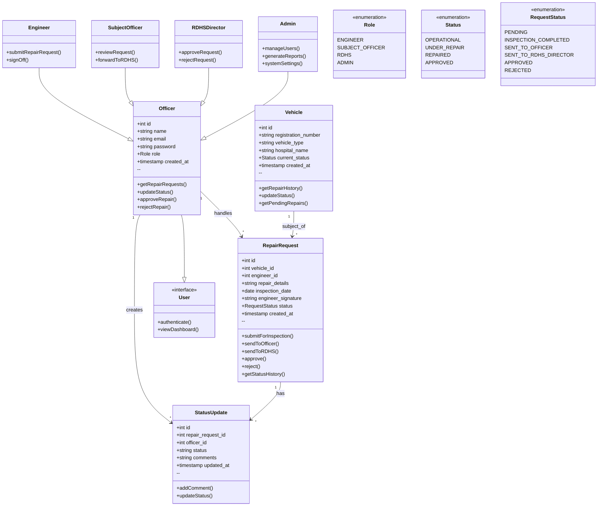

# Vehicle Repair Management System - Class Diagram

## Class Diagram

## Key Relationships

### One-to-Many (1:*)
- **Officer → RepairRequest**: One officer handles multiple repair requests
- **Officer → StatusUpdate**: One officer creates multiple status updates
- **Vehicle → RepairRequest**: One vehicle can have multiple repair requests
- **RepairRequest → StatusUpdate**: One repair request has multiple status updates

### Inheritance
- **Engineer**, **SubjectOfficer**, **RDHSDirector**, **Admin** inherit from **Officer**
- All user roles implement the **User** interface

## Entity Descriptions

### Officer
The base class for all system users. Contains authentication and role-based operations.
- **Attributes**: id, name, email, password, role, created_at
- **Methods**: getRepairRequests(), updateStatus(), approveRepair(), rejectRepair()

### Vehicle
Represents vehicles in the fleet undergoing repair management.
- **Attributes**: id, registration_number, vehicle_type, hospital_name, current_status, created_at
- **Methods**: getRepairHistory(), updateStatus(), getPendingRepairs()

### RepairRequest
The core workflow entity tracking the complete repair lifecycle.
- **Attributes**: id, vehicle_id, engineer_id, repair_details, inspection_date, engineer_signature, status, created_at
- **Methods**: submitForInspection(), sendToOfficer(), sendToRDHS(), approve(), reject(), getStatusHistory()

### StatusUpdate
Maintains an audit trail of all changes to repair requests with officer comments.
- **Attributes**: id, repair_request_id, officer_id, status, comments, updated_at
- **Methods**: addComment(), updateStatus()

### User Roles
- **Engineer**: Submits repair requests and provides technical assessments
- **SubjectOfficer**: Reviews requests and forwards to RDHS
- **RDHSDirector**: Makes final approval/rejection decisions
- **Admin**: System-wide management, user management, and reporting
