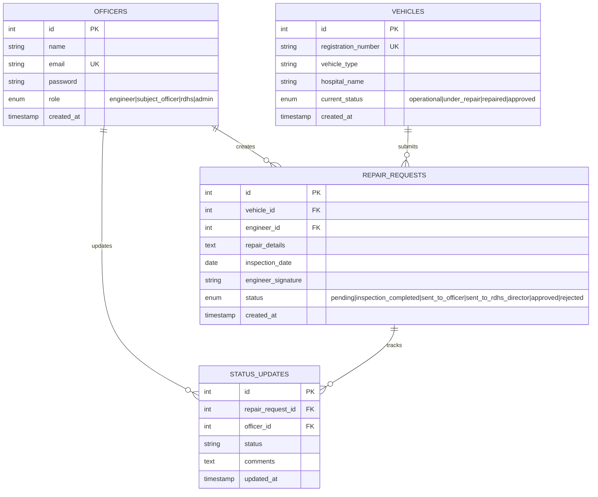
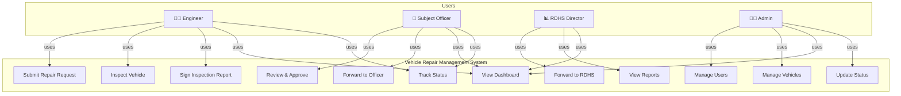
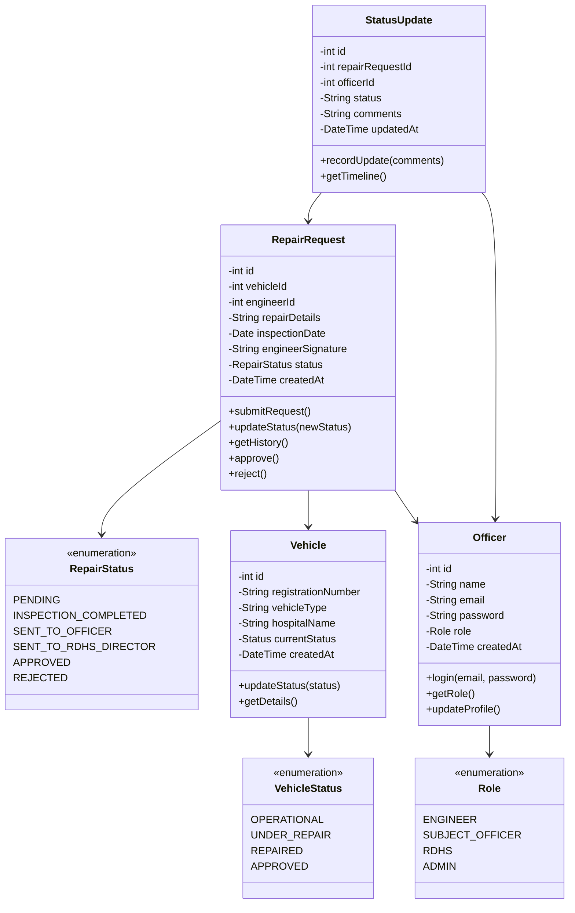
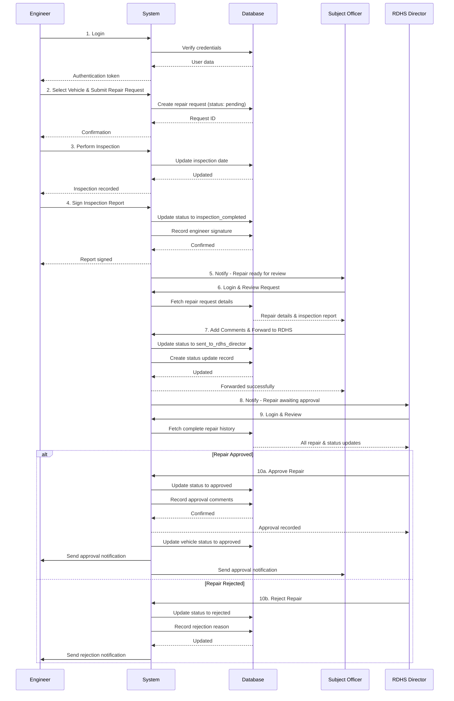
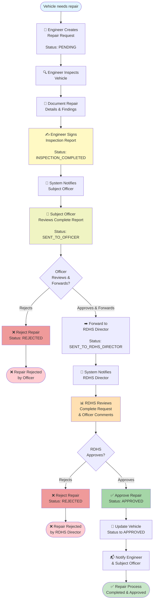
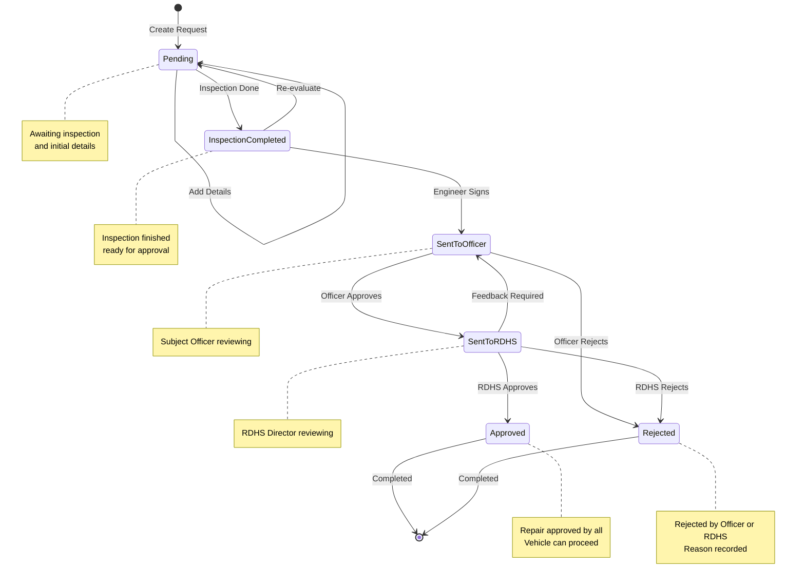
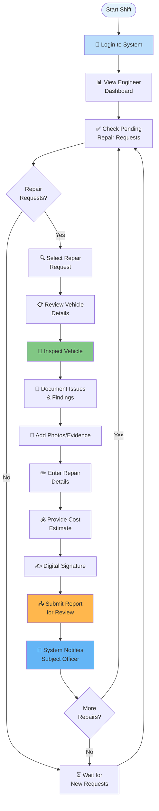

# Vehicle Repair Management System - UML & Database Diagrams

## 1. Entity-Relationship (ER) Diagram



---

## 2. Use Case Diagram



---

## 3. Class Diagram



---

## 4. Sequence Diagram - Repair Request Workflow



---

## 5. Business Process Diagram - Repair Request Workflow (CORRECTED)



---

## 6. State Diagram - Repair Request Lifecycle



---

## 7. Activity Diagram - Engineer Workflow



---

## System Overview

### Database Tables

| Table | Purpose | Key Fields |
|-------|---------|-----------|
| **OFFICERS** | User management | id, name, email, role, created_at |
| **VEHICLES** | Vehicle inventory | id, registration_number, vehicle_type, hospital_name, current_status |
| **REPAIR_REQUESTS** | Repair request tracking | id, vehicle_id, engineer_id, repair_details, status |
| **STATUS_UPDATES** | Repair history tracking | id, repair_request_id, officer_id, status, comments |

### User Roles & Permissions

| Role | Permissions |
|------|-------------|
| **Engineer** | Submit repairs, Inspect vehicles, Sign reports, View own repairs |
| **Subject Officer** | Review repairs, Approve/Reject, Forward to RDHS, View reports |
| **RDHS Director** | Final approval/rejection, View analytics, Generate reports |
| **Admin** | Manage users, Manage vehicles, System configuration |

### Repair Status Workflow

```
PENDING → INSPECTION_COMPLETED → SENT_TO_OFFICER → SENT_TO_RDHS_DIRECTOR → APPROVED ✅
                                                                          ✗ REJECTED ❌
```

